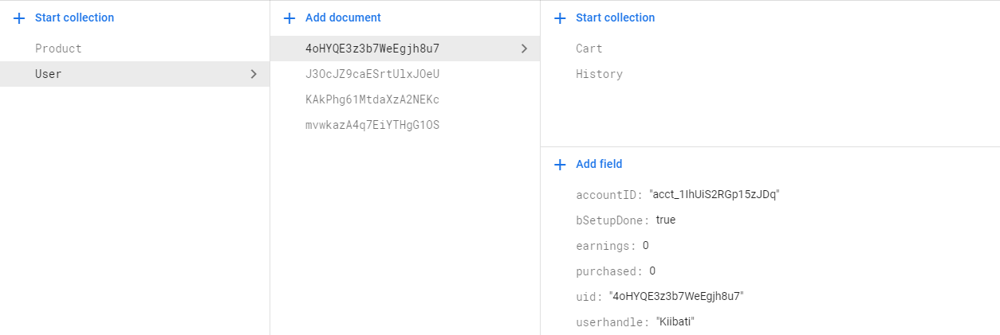
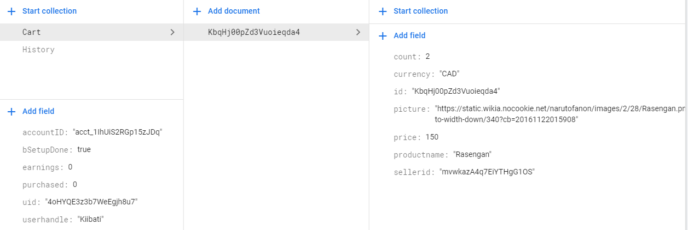
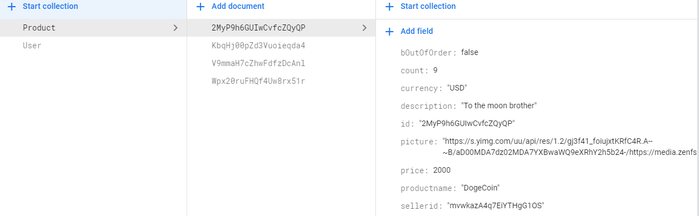

# Stripe_Marketplace
-   [Merchant Application Video]()
-   **Step By Step Video WIP**

##### TODO
-   Switch plugin to the new [flutter stripe plugin](https://pub.dev/packages/flutter_stripe)


### Stripe_Merchant_App V1.0
- This is the first version of the flutter + firebase + stripe merchant application.

### Setup Stripe Account
- Login to Stripe and setup everything you need to setup for 
- Get your stripe live key using this link -> [https://dashboard.stripe.com/test/apikeys](https://dashboard.stripe.com/test/apikeys)

- Set your Stripe Connect Redirects. Note that you would need to get this link from your cloud functions. Get your cloudfunction url and add `/stripeapi/token` to the end.
  Link here -> [https://dashboard.stripe.com/test/settings/connect](https://dashboard.stripe.com/test/settings/connect)


### Firebase
- Setup a firebase project and connect it to your flutter project. There are many videos on youtube teaching you how to do this so there would be no need to explain this.
- This pictures are samples of the collections used for this application. You should design your database the way it fits your application.

#### Data Structures
-   User Doc


-   User Cart


-   User History Doc


-   Product Doc



### Cloud Function
- Setup your firebase cloud function. You can [watch videos](https://youtu.be/ig5-4F9OmbM?t=104) on how to do this is all the code you would write to set it up.
- You need [npm and node](https://docs.npmjs.com/downloading-and-installing-node-js-and-npm#checking-your-version-of-npm-and-node-js)
```
npm install -g firebase -tools
firebase login
mkdir cloudFunction
cd cloudFunction
firebase init // setup accordingly 
cd function
// you can now install stripe and all the packages in the backend code in this repository
```
- After installing all the packages You have to configure your firebase config value.
- Replace the values in quote as you need to
```
firebase functions:config:set stripe.test_pk="YOUR_TEST_PRIVATE_KEY" stripe.test_sk=""YOUR_TEST_PRIVATE_KEY"" stripe.prod_sk=""YOUR_TEST_PROD_KEY"" stripe.prod_pk=""YOUR_TEST_PROD_KEY"" stripe.token_uri="https://connect.stripe.com/oauth/token" stripe.autorize_uri="https://connect.stripe.com/express/oauth/authorize" stripe.client_id=""
```
- You find your **Client ID** here: [https://dashboard.stripe.com/test/settings/connect](https://dashboard.stripe.com/test/settings/connect)

### Payment
-   This is how the payment system works.


### Dynamic Links
-   Dynamic Links are easy to set up, go to the Dynamic links button on the firebase dashboard.
-   Enter a domain, for me I chose flutterstripemerchant.page.link. This is the standard firebase way of creating dynamic links.
-   Click on the “New Dynamic Link” button
-   Enter a “URL Prefix”
-   Setup your dynamic link with an http that you want
-   Setup the IOS app if you want.
-   Setup your Android App,
-   Next and you are done with the dynamic link
-   You can check the details if you want but lets move to the next step.
---
-   Add ```firebase_dynamic_links: ^2.0.7``` to the `pubspec.yaml` in flutter.
-   All good, you can setup firebase more using the the [firebase_dynamic_links README](https://pub.dev/packages/firebase_dynamic_links)

### Payout
-   For now only US stripe accounts can use instant payout.


### Frontend
-   Hopefully by now you have setup your flutter app with your firebase account.
-   In the `constants.dart` file of the mobile app, there are some values that you have to edit for your specific app.
```
String cloudfunctionUrl = "YOUR_CLOUD_FUNCTION_URL/stripeapi";
String stripepaymentCloudUrl = "YOUR_CLOUD_FUNCTION_URL/stripepaymentapi";
String cloudfunctionAuthorizePath = "/authorize";
String cloudfunctionUserbalancePath = "/userbalance";
String cloudfunctionPayoutPath = "/payoutuser";
String cloudfunctionTokenPath = "/token";
String stripePrivateKey = "Your Stripe Private Key";
```

### Setup Checklist (This are reminders on what you have to do to setup everything)
- [ ] google-services.json from firebase to flutter app
- [ ] Setup firebase with flutter app
- [ ] Get Stripe TEST Private Key and Secret Key and the Prod. Keys. Private Keys should be used to figure out everything.
- [ ] Setup Dynamic Links
- [ ] Setup cloudfcuntion
- [ ] Setup your firebase config values for cloud functions
- [ ] Setup your Users Collections if you want or use Autentication. Watch the [video]() to understand the details.
- [ ] Get your client ID, change the switch to true for *OAUTH for Express accounts* and also setup Redirect URI. The link to all that is here[https://dashboard.stripe.com/test/settings/connect](https://dashboard.stripe.com/test/settings/connect)
- [ ] Make sure everything is connected. Nothing is magic, if everything is connected then it should all work.
